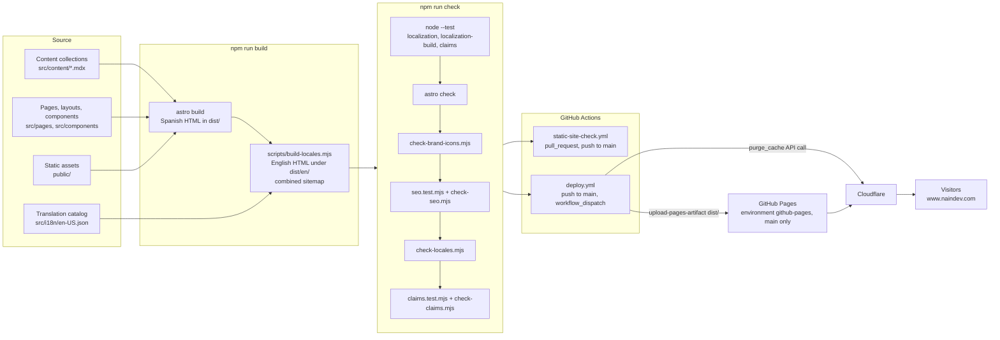

# Architecture

Status: Draft

Static site generated at build time. There is no application server, database or runtime API owned by this project. The layer rules from the template apply as build-time boundaries: content is data, Astro components render it, build scripts transform and validate the output.

## Layers

| Layer | Location | Responsibility | May call |
| :--- | :--- | :--- | :--- |
| Content | `src/content/{blog,casos,servicios}/*.mdx`, `src/data/`, `public/assets/data/` | Spanish source prose and structured data, validated by Zod schemas in `src/content.config.ts` | Nothing |
| Translation catalog | `src/i18n/en-US.json`, `src/i18n/runtime.json` | Reviewed English segments and interface messages | Nothing |
| Presentation | `src/pages/`, `src/layouts/`, `src/components/` | Routing, rendering, metadata (`SEO.astro`), Content Security Policy meta tag | Content, `src/utils/` |
| Utilities | `src/utils/` (`seo.ts`, `technologyRoutes.ts`, `analytics.js`) | Pure helpers for SEO, routes and analytics events | Nothing |
| Client scripts | `public/assets/js/` | Progressive enhancement in the browser: terminal, filters, 3D hero (`three.module.min.js`), locale messages | Runtime dictionary embedded in each page |
| Build pipeline | `scripts/build-locales.mjs`, `scripts/lib/localization.mjs` | Post-build English generation from Spanish HTML and the catalog | Built `dist/`, catalog |
| Validation | `scripts/*.test.mjs`, `scripts/check-*.mjs`, `astro check` | Contracts run by `npm run check` | Built `dist/`, sources |
| Local tooling | `scripts/sync-translations.mjs`, `watch-translations.mjs`, `review-translations.mjs`, `translate-local.py`, `audit-translations-local.py` | Optional draft generation and review; never runs in CI | Local NainWrite/Ollama on loopback |
| Delivery | `.github/workflows/deploy.yml`, `CNAME` | Build, validate, upload and deploy from `main` | GitHub Pages, Cloudflare API |

## Component diagram

Keep this diagram in sync with the code; update it in the same commit as any structural change.

Order inside `npm run check` (from `package.json`): unit tests (including `claims.test.mjs`), `astro check`, full build, brand icons, SEO, locales, claims scan over sources and `dist/`.

## Boundaries and contracts

- **Content schemas**: `src/content.config.ts` rejects entries with missing required fields; blog `seoTitle` is limited to 60 characters and `description` to 160.
- **Spanish is authoritative** (ADR-001 in `specs/003-english-localization/`). English pages exist only as output of `build-locales.mjs`; a missing, changed or draft translation stops the build.
- **No inference in CI or production** (LOC-006). Local generation writes proposals under the git-ignored `.astro/translations/` only.
- **Deployment boundary** (DES-006): only a push to `main` or a manual dispatch runs `deploy.yml`; the `github-pages` environment accepts `main` only (recorded in `specs/004-design-collaboration/plan.md`).
- **Branch boundary** (DES-001, DES-002): ruleset `protect-non-design-branches` restricts every branch except `design/**` for non-admins.
- **Production verification**: `scripts/check-production.mjs` compares the public site with `dist/` using read-only GET requests; it is not part of CI.

## Cross-cutting concerns

- **Security headers**: the Content Security Policy is a `<meta http-equiv>` tag in `src/components/SEO.astro`. `public/_headers` also declares headers; GitHub Pages does not process `_headers` files, so whether any of those headers are applied depends on the Cloudflare configuration. Assumption, not verified.
- **Edge / CDN**: Cloudflare sits in front of GitHub Pages. Evidence: `check-production.mjs` decodes Cloudflare email obfuscation, and `deploy.yml` purges the Cloudflare cache. DNS and proxy settings are not stored in this repository.
- **Analytics**: Plausible, allowed in the CSP; event helpers in `src/utils/analytics.js`.
- **Secrets**: none are stored in the repository (`SECURITY_POLICY.md`). The only workflow secrets referenced are `CLOUDFLARE_ZONE` and `CLOUDFLARE_API_TOKEN`; see `41-blockers.md`.
- **Error pages**: `src/pages/404.astro` renders a `noindex` page used for unknown routes.
- **Redirects**: legacy `.html` and renamed service routes are declared in `astro.config.mjs` and emitted as static redirect documents with `noindex`.
