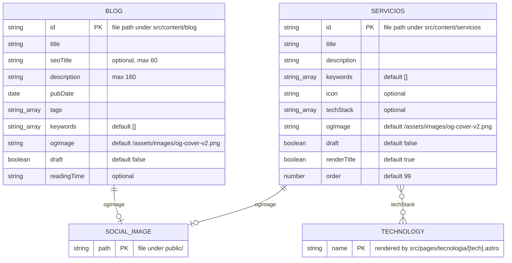

# Data model

Status: Draft

This project has no database, no migrations and no runtime persistence. All data is static content committed to the repository, validated at build time by Astro content collections (`src/content.config.ts`) and rendered into HTML.

## Entity-relationship diagram

Kept in sync with `src/content.config.ts`; update it in the same commit as any schema change.

Relationships are implicit, not enforced by the schema: collections share string values (technology names, `ogImage` paths) and link to each other through MDX content and routes.

`SOCIAL_IMAGE` and `TECHNOLOGY` are derived concepts shown for clarity; they have no schema of their own. Technology pages are generated only from service `techStack` values.

## Entities and invariants

### Blog (`src/content/blog/`)

- `description` has at most 160 characters; `seoTitle`, when present, at most 60 (schema).
- Each rendered article exposes a visible publication date matching `pubDate` in structured data (SEO-005, checked by `check-seo.mjs`).

### Case studies (removed)

- The `casos` collection and `src/content/casos/` were removed by spec 007 (CASE-001). Retired URLs are redirect documents declared in `astro.config.mjs`. Reintroducing case studies requires a new spec.

### Services (`src/content/servicios/`)

- A declared `ogImage` must resolve to an existing asset (SEO-010).

### Translation catalog (`src/i18n/en-US.json`)

- Content-addressed: an entry applies only to the exact Spanish source segment it was reviewed against (LOC-002).
- A release build fails if any published Spanish segment lacks a reviewed English entry.

### Other static data

- `src/data/testimonials.json`, `src/i18n/runtime.json` and `public/assets/data/` (`projects.json`, `impact-metrics.json`, `tech-stack.json`, `terminal-commands.json`) are plain JSON loaded at build time or by client scripts. They have no Zod schema; `check-locales.mjs` verifies that every `message()` key used by client code exists in `runtime.json`.

## Persistence

- Storage: Git. The build output `dist/` is regenerated in CI and never committed.
- Migrations: none. Schema changes are edits to `src/content.config.ts` and are enforced by `astro build` and `astro check`.
- Private or draft material lives in git-ignored paths (`src/content/marketing/`, `docs/private/`).
