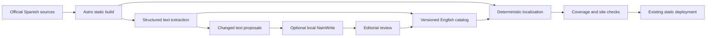

# Implementation Plan

1. Define requirements and failing tests for safe catalog translation and routing.
2. Extract semantic text segments from generated Spanish HTML using parse5.
   Keep markup as immutable numbered placeholders; never translate source code.
3. Generate English pages in a deterministic post-build step, using the same
   components/assets and a content-addressed catalog. This avoids two independently
   maintained template trees and detects newly introduced text automatically.
4. Localize interactive text through explicit locale-aware data and shared helpers.
5. Add a review-only local translation adapter and source-change synchronization.
6. Validate coverage, both locales, navigation and SEO before uploading artifacts.
7. Inspect built pages in the browser and record exact release/remaining evidence.

## Architecture

Builds never contact inference services. Missing/rejected translations stop the
build before upload. A complete built artifact contains both languages. The local
generation task can run on changed text while the last released site stays live.
