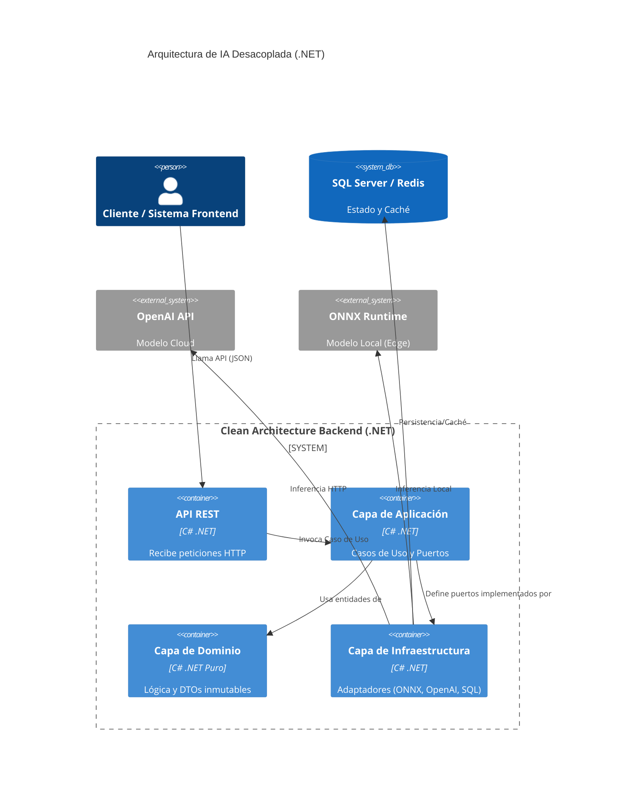

# Clean Architecture en .NET para Sistemas de IA Generativa: Guía Práctica

La Inteligencia Artificial generativa ha irrumpido en las arquitecturas de software como un huracán. Los modelos LLM y de difusión abren nuevas fronteras en la creación de valor, pero introducen un factor que a los ingenieros de backend nos aterra: **la estocasticidad**. 

A diferencia de un cálculo determinista, un modelo de IA puede responder de forma distinta a la misma entrada. Si no controlamos esta incertidumbre, la lógica de negocio se acopla a las idiosincrasias de un proveedor de IA (vendor lock-in) y nuestro sistema crítico se vuelve frágil e impredecible. 

En este artículo veremos cómo domar la IA mediante **Clean Architecture en .NET (C#)**, estableciendo límites claros para proteger nuestro modelo de dominio.

## 1. El Desafío: IA en Sistemas Críticos

Cuando integras IA en un monolito o microservicio heredado, el patrón más común (y peligroso) es invocar la API del modelo de IA directamente desde la lógica de negocio o desde el controlador HTTP.

¿Qué ocurre cuando:
- El proveedor de IA cambia la firma de su API?
- El modelo devuelve un JSON malformado (hallucination)?
- Necesitas ejecutar pruebas unitarias (Unit Tests) sin incurrir en costes de API?
- Deseas cambiar a un modelo local (ONNX) por motivos de latencia o privacidad?

Si tu lógica de negocio conoce la existencia de "OpenAI", "Anthropic" o "ONNX", tienes una **fuga de abstracción grave**.

## 2. Fundamentos de Clean Architecture para IA

Clean Architecture, promovida por Robert C. Martin, postula que las dependencias solo pueden apuntar hacia adentro: desde los detalles de implementación hacia las reglas puras del negocio.

Al aplicar esto a un sistema con IA, las capas se distribuyen así:

1. **Domain Layer (Núcleo):** Entidades puras y reglas invariables. Aquí no hay IA, solo C# puro. Define *qué* necesitamos (ej. `IInferenceResult`).
2. **Application Layer (Casos de Uso):** Orquesta el flujo de trabajo. Define los **Puertos** (interfaces) que representan servicios de IA (ej. `IModelInferencePort`).
3. **Infrastructure Layer (Adaptadores):** Implementa los puertos. Aquí se encuentran los SDKs de OpenAI, clientes HTTP, ONNX Runtime, etc.
4. **Presentation Layer (Entrada):** APIs REST, gRPC, Workers de RabbitMQ que reciben peticiones de los clientes.

### Diagrama de Arquitectura (C4 Container)



## 3. Caso Práctico: Servicio de Inferencia Desacoplado

Veamos cómo se traduce esto a código C#. Nuestro objetivo es analizar el sentimiento de un texto y clasificar su urgencia, pero nuestro dominio no debe saber si usamos un LLM en la nube o un modelo ONNX en local.

### El Puerto en la Capa de Aplicación

Definimos la interfaz que nuestra infraestructura deberá implementar. Utilizamos `record` para garantizar DTOs inmutables.

```csharp
// Domain / Application Layer
public record InferenceRequest(string TextContext);
public record InferenceResult(float Confidence, string Classification);

public interface ITextClassificationPort
{
    Task<InferenceResult> ClassifyAsync(InferenceRequest request, CancellationToken ct);
}
```

### El Caso de Uso (Application Layer)

El caso de uso consume la interfaz, pero ignora completamente la implementación.

```csharp
// Application Layer
public class AnalyzeTextUseCase
{
    private readonly ITextClassificationPort _classificationPort;
    private readonly IBusinessRuleValidator _validator;

    public AnalyzeTextUseCase(
        ITextClassificationPort classificationPort, 
        IBusinessRuleValidator validator)
    {
        _classificationPort = classificationPort;
        _validator = validator;
    }

    public async Task<InferenceResult> ExecuteAsync(string text, CancellationToken ct)
    {
        // 1. Validaciones previas de negocio
        _validator.EnsureValidInput(text);

        // 2. Ejecutar inferencia (El caso de uso no sabe qué IA se ejecuta)
        var request = new InferenceRequest(text);
        var result = await _classificationPort.ClassifyAsync(request, ct);

        // 3. Post-validación del output de la IA (Mitigar estocasticidad)
        if (result.Confidence < 0.8f)
        {
            throw new InferenceConfidenceException("Confianza insuficiente para decisión automática.");
        }

        return result;
    }
}
```

## 4. Manejo de la Incertidumbre: Puertos y Adaptadores

Ahora implementamos la capa de infraestructura. Aquí es donde nos "ensuciamos" con los SDKs, manejamos reintentos (Retries) usando Polly, y parseamos las salidas a veces impredecibles de la IA.

### Adaptador para ONNX (Local Edge)

```csharp
// Infrastructure Layer
public class OnnxClassificationAdapter : ITextClassificationPort
{
    private readonly InferenceSession _session;

    public OnnxClassificationAdapter(string modelPath)
    {
        // Inicialización pesada en el arranque de la app
        _session = new InferenceSession(modelPath);
    }

    public async Task<InferenceResult> ClassifyAsync(InferenceRequest request, CancellationToken ct)
    {
        // ... Lógica de tokenización y ejecución del tensor ...
        // Este código es feo, pero está aislado del resto del sistema.
        
        // Simulación:
        // var outputTensor = _session.Run(inputs);
        // var (label, confidence) = ExtractHighestProbability(outputTensor);
        
        return new InferenceResult(0.95f, "URGENTE");
    }
}
```

Para cambiar a un modelo en la nube (ej. OpenAI), simplemente crearíamos un `OpenAiClassificationAdapter` y cambiaríamos el registro en el contenedor de Inyección de Dependencias, **sin tocar una sola línea de la capa de aplicación o de dominio.**

## 5. Rendimiento y Escalabilidad

Los sistemas de IA consumen recursos intensivamente. Para que tu backend .NET soporte tráfico masivo, considera lo siguiente:

1. **Caché Semántica (Redis):** Si procesas un texto muy similar a uno anterior, usa una base de datos vectorial o Redis para devolver un resultado cacheado en lugar de volver a ejecutar la inferencia.
2. **Procesamiento Asíncrono (RabbitMQ):** Nunca ejecutes inferencias pesadas en el hilo de la petición HTTP. Coloca la tarea en RabbitMQ y procesa en background mediante *HostedServices* o *Workers*.
3. **Observabilidad (OpenTelemetry):** Registra el tiempo exacto que tarda el adaptador de IA. La latencia de la red hacia el proveedor de IA suele ser el cuello de botella principal, y debes poder trazarlo sin confundirlo con problemas en tu base de datos SQL.

## Conclusión

El diseño basado en Clean Architecture nos permite abrazar el poder de la IA sin comprometer la estabilidad del sistema core. Mantener las fronteras estrictas te garantiza que cuando salga el próximo modelo de vanguardia, su integración será cuestión de añadir un adaptador, no de reescribir tu sistema crítico.

---

### ¿Estás construyendo un sistema con IA en producción?

La arquitectura es solo el primer paso. He recopilado las prácticas fundamentales de infraestructura, monitorización, y despliegue en un recurso gratuito.

<a href="/recursos/checklist-ia" class="button button-primary" data-calendly-track="blog-clean-architecture" style="margin-top: 1rem; display: inline-block;">Descargar Checklist de Arquitectura para IA (PDF)</a>

Si prefieres que analice directamente tu sistema y elabore un plan de acción para su escalabilidad, **<a href="https://calendly.com/aitornainmendozavallejo-ksez/30min" target="_blank" rel="noopener noreferrer">agenda una auditoría gratuita conmigo</a>**.
