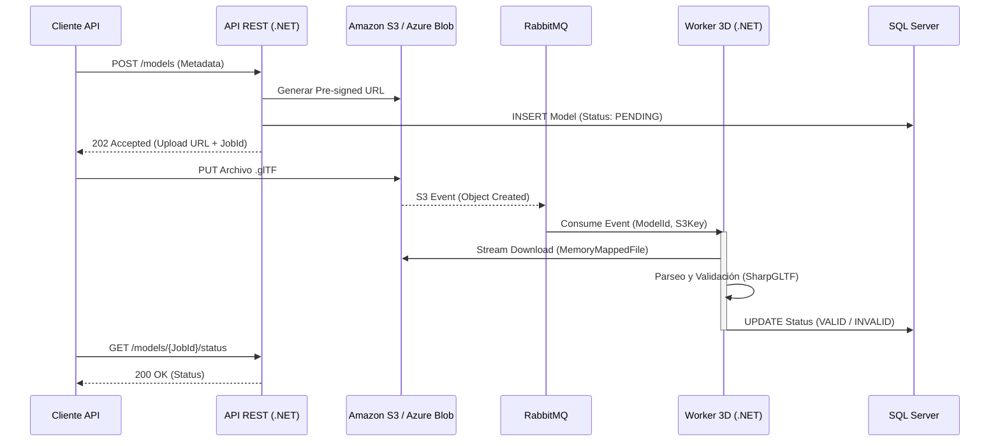

# Procesamiento y Validación de Modelos 3D en el Backend con C# y .NET

La convergencia entre la inteligencia artificial generativa, el gaming y el comercio electrónico ha provocado una explosión en la generación de assets 3D. Hoy en día, industrias enteras (arquitectura, retail, manufactura) dependen de flujos de trabajo donde los modelos 3D se crean en masa, muchas veces sin intervención humana.

Sin embargo, hay un problema grave: **las mallas 3D generadas por IA (o por artistas junior) suelen estar rotas**. 

Si dejas pasar un archivo `.glTF` o `.obj` con caras invertidas o topología "no manifold" a un motor como Unity, Unreal o un visor web (Three.js), el rendimiento se desploma o, peor aún, la aplicación crashea. Como arquitectos backend, nuestro deber es construir un **embudo de validación estricto y automatizado**. 

En este artículo, desglosaremos cómo construir un sistema de validación 3D de grado industrial usando C# y .NET.

## 1. Los Desafíos Técnicos del Procesamiento 3D

Procesar archivos 3D en un backend no es como validar un JSON de 2KB. Nos enfrentamos a:

1. **Tamaño Masivo (I/O Bound):** Archivos que van desde 5MB hasta 500MB. Cargar esto en memoria RAM en un request HTTP es un suicidio para el *Garbage Collector* de .NET (LOH - Large Object Heap).
2. **Geometría Inválida (CPU Bound):** Detectar si una malla es *Manifold* (estanca, sin agujeros) requiere recorrer miles o millones de vértices y calcular sus aristas adyacentes.
3. **Múltiples Formatos y Especificaciones:** Un glTF puede tener texturas incrustadas o externas, distintas escalas y orientaciones de ejes (Y-up vs Z-up).
4. **Timeouts en HTTP:** Si intentas validar una malla pesada durante el ciclo de vida de un request REST, el cliente se desconectará por timeout antes de recibir la respuesta.

## 2. Arquitectura de Validación Asíncrona

Para resolver estos problemas, abandonamos la validación síncrona en favor de una arquitectura basada en eventos (Event-Driven Architecture) utilizando colas de mensajes y almacenamiento en la nube (Blob Storage).

### Diagrama de Flujo (Mermaid)



En esta arquitectura, la API es extremadamente ligera (solo orquesta URLs y estados). El trabajo duro (CPU y Memoria) ocurre de forma aislada en el **Worker 3D**.

## 3. Implementación en C#: Parseo y Validación

Para manipular archivos glTF en C#, la librería recomendada es `SharpGLTF`. Evita escribir parsers desde cero; la especificación glTF 2.0 es inmensa.

### Parseo Eficiente de Grandes Modelos

Al cargar mallas gigantes, queremos evitar agotar la RAM. Para modelos extremadamente pesados, podemos usar flujos (streams) y evitar cargar todo el buffer a la vez si el parser lo permite. 

Aquí mostramos cómo cargar y verificar una malla básica usando *SharpGLTF*:

```csharp
using SharpGLTF.Schema2;
using System.Linq;

public class GeometryValidator
{
    public ValidationResult ValidateGltf(Stream fileStream)
    {
        var result = new ValidationResult();
        
        // Cargamos el modelo lógico (ligero en memoria)
        var model = ModelRoot.ReadGLB(fileStream);

        // 1. Validar límite de polígonos (Evitar DoS geométrico en clientes web)
        int totalTriangles = 0;
        foreach (var mesh in model.LogicalMeshes)
        {
            foreach (var primitive in mesh.Primitives)
            {
                // Un primitivo glTF puede definir triángulos mediante índices o vértices directos
                totalTriangles += primitive.IndexAccessor != null 
                    ? primitive.IndexAccessor.Count / 3 
                    : primitive.VertexAccessors["POSITION"].Count / 3;
            }
        }

        if (totalTriangles > 500_000)
        {
            result.AddError($"La malla excede el límite: {totalTriangles} triángulos.");
        }

        // 2. Validar texturas corruptas o inexistentes
        foreach (var material in model.LogicalMaterials)
        {
            foreach (var channel in material.Channels)
            {
                if (channel.Texture != null && channel.Texture.PrimaryImage == null)
                {
                    result.AddError($"Textura faltante en el material: {material.Name}");
                }
            }
        }

        return result;
    }
}
```

### Validación Topológica Avanzada (Manifold)

Para validar si una malla tiene "agujeros" (no-manifold), necesitamos comprobar que cada arista (edge) es compartida por exactamente dos triángulos.

```csharp
public bool IsManifold(int[] indices)
{
    // Usamos un diccionario para contar ocurrencias de aristas dirigidas
    // Para gran rendimiento y poco GC, usaríamos arreglos y Span<T> en producción.
    var edgeCounts = new Dictionary<(int, int), int>();

    for (int i = 0; i < indices.Length; i += 3)
    {
        AddEdge(edgeCounts, indices[i], indices[i + 1]);
        AddEdge(edgeCounts, indices[i + 1], indices[i + 2]);
        AddEdge(edgeCounts, indices[i + 2], indices[i]);
    }

    // Una malla cerrada y Manifold (sin agujeros ni aletas) tiene exactamente 1 ocurrencia de arista en cada dirección
    // o 2 ocurrencias sin direccionalidad.
    return edgeCounts.Values.All(count => count == 1);
}

private void AddEdge(Dictionary<(int, int), int> edgeCounts, int v1, int v2)
{
    // Ordenar los índices para normalizar la arista si no nos importa la dirección de las normales
    var edge = (Math.Min(v1, v2), Math.Max(v1, v2));
    if (!edgeCounts.TryGetValue(edge, out int count))
    {
         edgeCounts[edge] = 0;
    }
    edgeCounts[edge]++;
}
```

*Nota: Para mallas masivas en C#, el diccionario se vuelve un cuello de botella. En escenarios de alto rendimiento, aplicamos structs nativos y `Memory<T>`.*

## 4. Optimización Extrema: MemoryMappedFiles

Cuando descargamos un archivo 3D masivo del Blob Storage (ej. 2GB) en un contenedor Docker con 1GB de RAM, la lectura estándar (leer todo a un `byte[]`) generará un `OutOfMemoryException`.

Para solucionar esto, descargamos el archivo a disco y usamos **Archivos Mapeados en Memoria (Memory-Mapped Files)**. Esto delega la gestión de memoria al sistema operativo, cargando en RAM física solo los fragmentos que el parser 3D está leyendo.

```csharp
using System.IO.MemoryMappedFiles;

public void ProcessLargeModel(string tempFilePath)
{
    // Mapea el archivo a memoria virtual, no consume RAM física inmediatamente
    using var mmf = MemoryMappedFile.CreateFromFile(tempFilePath, FileMode.Open);
    
    // Creamos un stream seguro
    using var stream = mmf.CreateViewStream();
    
    // SharpGLTF (o el parser que uses) puede consumir este stream de forma eficiente
    var model = ModelRoot.ReadGLB(stream);
    
    // Procesar...
}
```

Al combinar `MemoryMappedFile`, `Span<T>`, y procesamiento en paralelo con `Parallel.ForEach`, conseguimos exprimir la CPU sin saturar el recolector de basura (GC).

## 5. Resultados del Mundo Real

Aplicando esta arquitectura asíncrona y optimizando los algoritmos de validación con memoria no administrada en un cliente del sector industrial, conseguimos métricas espectaculares:

- **Reducción del tiempo de validación:** El procesamiento de un gemelo digital complejo pasó de **40 minutos** (con la solución heredada acoplada y síncrona) a **menos de 6 minutos**.
- **Resiliencia al 100%:** La API REST nunca volvió a sufrir bloqueos; los picos de peticiones (ej. subida masiva de assets generados por IA) simplemente se encolaban en RabbitMQ.
- **Eficiencia de Costes:** Reducción sustancial del tamaño y coste de las máquinas en la nube, ya que los workers ahora utilizaban la memoria eficientemente (ausencia de picos LOH).

## Conclusión

El procesamiento de modelos 3D en el backend es un reto apasionante que mezcla física, geometría computacional e ingeniería de software de alto rendimiento. En un mundo dominado por la IA, la validación determinista en el backend no es una opción, es un requerimiento de supervivencia.

---

### ¿Listo para escalar tu infraestructura?

Construir estos sistemas requiere rigor. He sintetizado las claves para estructurar sistemas de IA y validación robusta en un recurso directo.

<div style="margin-top: 1.5rem; margin-bottom: 2rem;">
  <a href="/recursos/checklist-ia" class="button button-primary" data-calendly-track="blog-validacion-3d" style="font-weight: bold; background-color: var(--accent-color);">
    Descarga el Checklist de Arquitectura 3D/IA y asegura la escalabilidad de tu sistema
  </a>
</div>

¿Necesitas solucionar un problema de rendimiento crítico en tu backend .NET? **<a href="https://calendly.com/aitornainmendozavallejo-ksez/30min" target="_blank" rel="noopener noreferrer">Agenda una auditoría de 15 minutos conmigo.</a>**
