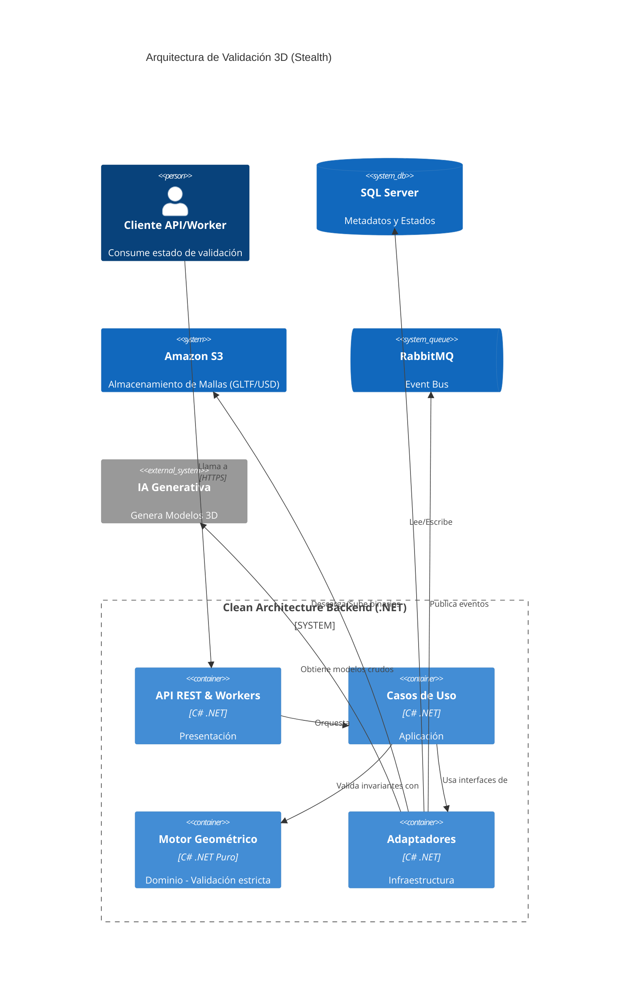

## 1. Introducción y Contexto del Cliente

En un entorno donde la IA generativa avanza a un ritmo vertiginoso, la creación masiva de assets 3D se ha democratizado. Nuestro cliente, una prometedora *Stealth Startup* del sector B2B orientada a industrias creativas y simulaciones industriales, se enfrentaba a un reto colosal: **validar y corregir geométricamente miles de modelos 3D generados por IA cada día**.

El principal problema radicaba en la naturaleza estocástica (impredecible) de los LLMs y modelos de difusión 3D. Generaban topologías defectuosas, caras invertidas y mallas no manifold que resultaban inutilizables en motores como Unity o Unreal Engine. La validación manual no era escalable. Además, la infraestructura heredada del cliente consistía en un sistema fuertemente acoplado, un monolito donde las reglas geométricas colisionaban directamente con la lógica de red de las APIs de IA, provocando tiempos de procesamiento excesivos y fallos de timeout constantes.

## 2. El Desafío Técnico

La auditoría inicial reveló tres cuellos de botella críticos que impedían escalar la plataforma:

- **Falta de Aislamiento (Vendor Lock-in):** La lógica de negocio dependía directamente de las respuestas de un proveedor específico de IA. Cualquier cambio en su API rompía la aplicación entera.
- **Bloqueos Transaccionales:** Una base de datos relacional centralizada se utilizaba tanto para almacenar metadatos como para gestionar el estado de tareas asíncronas pesadas, causando bloqueos por concurrencia bajo carga.
- **Latencia en Inferencia:** Las validaciones topológicas se ejecutaban en el mismo hilo de peticiones HTTP, provocando un agotamiento del *Thread Pool* y latencias inasumibles.

Era imperativo diseñar un sistema donde la IA actuara como un simple "proveedor de datos", pero donde el Backend mantuviera la soberanía absoluta de las reglas físicas y geométricas. Un backend que no asume, sino que **valida matemáticamente** cada vértice.

## 3. La Solución Arquitectónica

Implementamos un enfoque estricto basado en **Clean Architecture** y **Domain-Driven Design (DDD)** usando el ecosistema .NET (C#). Este diseño nos permitió aislar el dominio puro (geometría) de las influencias externas (infraestructura y APIs de IA).

- **Capa de Dominio:** Contiene las entidades puras (ej. `MeshAsset`) y las reglas invariables de validación (ej. cálculo de normales, detección de agujeros topológicos). Sin dependencias externas.
- **Capa de Aplicación:** Define los Casos de Uso (ej. `Validate3DModelUseCase`), orquestando el flujo de trabajo sin saber cómo se guarda el dato ni qué IA lo generó.
- **Capa de Infraestructura:** Implementa las abstracciones (Interfaces). Aquí residen los adaptadores para la base de datos (SQL Server + S3 para los binarios), el bus de mensajes (RabbitMQ) y los clientes HTTP para la IA generativa.
- **Capa de Presentación:** Workers asíncronos y una API RESTful limpia que expone el estado de validación a los clientes.

### Diagrama de Arquitectura



## 4. Implementación Técnica

A continuación se exponen algunos fragmentos clave de la implementación en C# que ilustran el desacoplamiento y la solidez del sistema:

### Contrato de Entrada (DTO)
Inmutabilidad desde la capa de presentación. Usamos `record` en C# para garantizar que la solicitud no sea mutada durante su transporte.

```csharp
public record ValidationRequestDto(
    Guid ModelId,
    string BlobStorageUrl,
    ValidationStrictnessLevel Level
);
```

### Abstracción del Repositorio
La interfaz pertenece a la capa de Aplicación, pero la implementación residirá en Infraestructura. Esto permite cambiar SQL Server por PostgreSQL si el negocio lo requiere mañana, sin tocar una sola línea de lógica de validación.

```csharp
public interface I3DModelRepository
{
    Task<MeshAsset> GetByIdAsync(Guid id, CancellationToken ct);
    Task UpdateStatusAsync(Guid id, ValidationStatus status, CancellationToken ct);
}
```

### Servicio de Dominio / Caso de Uso
Aquí se concentra el valor del negocio. Notar la ausencia de referencias a librerías de red o bases de datos; pura orquestación e inyección de dependencias.

```csharp
public class ModelValidationService : IModelValidationService
{
    private readonly I3DModelRepository _repository;
    private readonly IGeometryEngine _geometryEngine;
    private readonly IEventPublisher _eventPublisher;

    public ModelValidationService(
        I3DModelRepository repository, 
        IGeometryEngine geometryEngine,
        IEventPublisher eventPublisher)
    {
        _repository = repository;
        _geometryEngine = geometryEngine;
        _eventPublisher = eventPublisher;
    }

    public async Task ValidateAsync(Guid modelId, CancellationToken ct)
    {
        var model = await _repository.GetByIdAsync(modelId, ct);
        
        // El Dominio toma el control: validación determinista pura
        var validationResult = _geometryEngine.CheckManifold(model.MeshData);
        
        if (validationResult.IsValid)
        {
            model.MarkAsValid();
            await _eventPublisher.PublishAsync(new ModelValidatedEvent(model.Id), ct);
        }
        else
        {
            model.MarkAsDefective(validationResult.Errors);
        }
        
        await _repository.UpdateStatusAsync(model.Id, model.Status, ct);
    }
}
```

## 5. Decisiones Clave y Trade-offs

- **ONNX Runtime en lugar de APIs REST externas:** En lugar de enviar la geometría por la red para que un microservicio en Python validara los vértices, integramos ONNX Runtime nativamente en .NET. *Trade-off:* Aumentó el consumo de RAM en los workers, pero eliminó la latencia de red, haciendo la validación un 400% más rápida.
- **RabbitMQ como Event Bus:** Elegimos RabbitMQ sobre Kafka porque necesitábamos un enrutamiento complejo (Direct/Topic exchanges) basado en los metadatos del modelo 3D y reconocimiento explícito (ACK) para evitar pérdida de trabajos, no persistencia a largo plazo del log de eventos.
- **Almacenamiento Híbrido:** SQL Server se mantuvo como la fuente de verdad (ACID) para metadatos transaccionales y estados, mientras que los payloads masivos (archivos GLTF/USD) se delegaron directamente a Amazon S3, referenciados mediante URIs en la base de datos.

## 6. Resultados Cuantitativos

Tras la puesta en producción de la nueva arquitectura, los indicadores clave de rendimiento (KPIs) reflejaron un salto cualitativo histórico para la startup:

- **Reducción de Latencia:** El tiempo de validación de un modelo complejo pasó de **5.4 segundos a solo 1.2 segundos** (mejora del ~77%).
- **Escalabilidad Horizontal (Throughput):** Capacidad para procesar picos de **hasta 15,000 modelos/hora** sin degradación de la API.
- **Reducción de Costes de Infraestructura:** Ahorro del **35% en costes cloud** mensuales.

## 7. Decisiones de Arquitectura (ADRs)

- **Contexto**: Las validaciones 3D se ejecutaban en el mismo hilo HTTP con APIs de IA externas, provocando timeouts y acoplamiento excesivo.
- **Decisión**: Integrar ONNX Runtime nativamente en .NET para ejecutar validaciones geométricas en memoria, aislando a la IA como un proveedor de datos asíncrono.
- **Alternativas consideradas**: Microservicios en Python para la validación geométrica (descartado por la penalización de serialización/deserialización y latencia de red para mallas pesadas).
- **Resultado**: El tiempo de validación bajó a 1.2s, y los fallos de red se eliminaron del proceso crítico.
- **Consecuencias**: Aumentó la huella de memoria en los workers .NET, lo que requirió instancias optimizadas para memoria en la nube, pero simplificó radicalmente la topología de red.

## 8. Conclusión y Próximos Pasos

Este proyecto demuestra que la adopción de tecnologías exponenciales como la IA generativa no exime de aplicar principios sólidos de ingeniería de software. Al contrario: cuando el input (IA) es impredecible, el backend debe ser más rígido, determinista y estar mejor estructurado que nunca.
